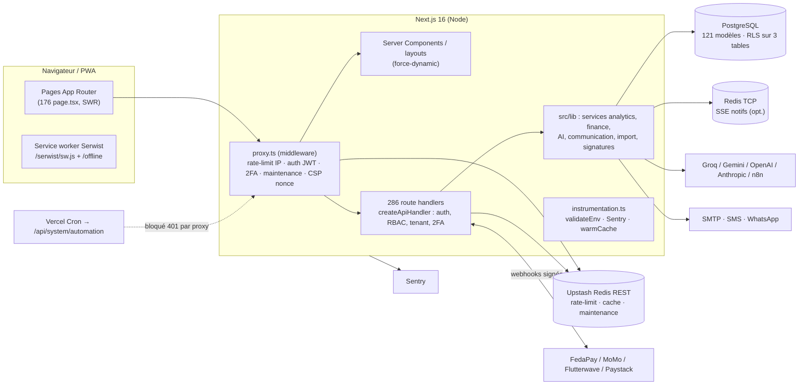
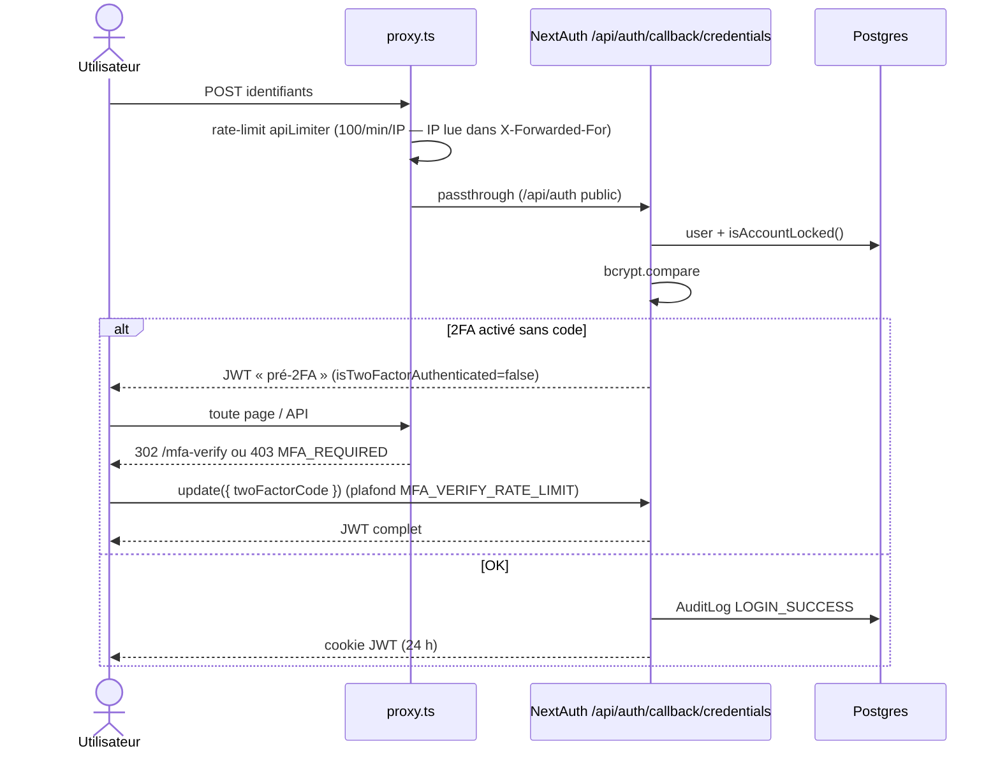
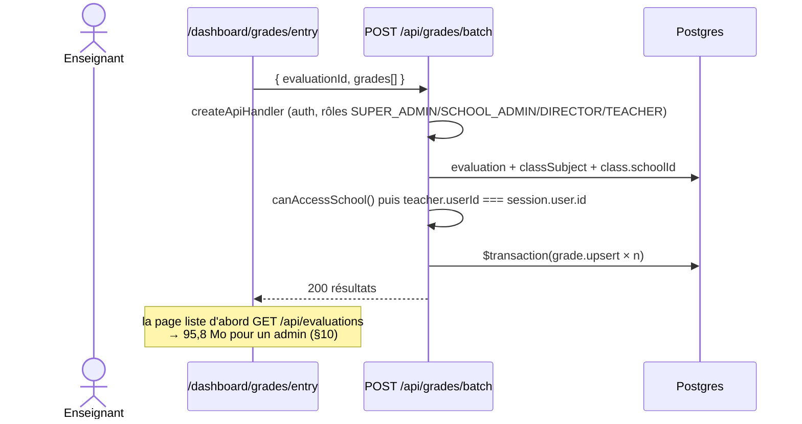
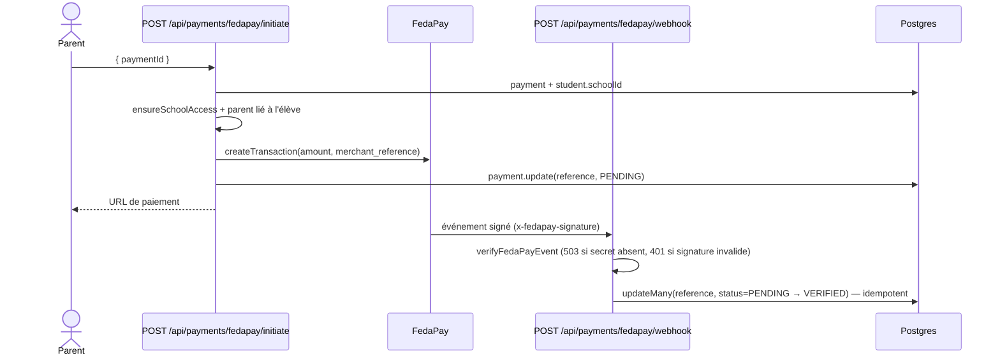

# Audit complet — EduPilot

> **Date** : 2026-09-11 · **Branche** : `release/1.2-consolidation` (HEAD `dccee96`, à égalité avec `main`) · **Version** : `1.2.0`
> **Auditeur** : Claude Code (audit en lecture seule, aucune modification de source)
> **Machine** : Intel i7-1355U (12 threads), 15 Go RAM, Linux 7.0, Node 22.22.3, npm 10.9.8
> **Base de mesure** : PostgreSQL embarqué (port 5433, jetable) peuplé par `npm run db:seed` — 3 écoles, 2 571 utilisateurs, 947 élèves, 125 004 notes, 7 767 présences, 3 245 paiements.

**Légende de certitude** : **[VÉRIFIÉ]** exécuté/observé · **[LU]** constaté dans le code · **[SUPPOSÉ]** déduction.
**Contexte non fourni** (champs `[À REMPLIR]`) : objectif, utilisateurs cibles et URL ont été **déduits** du code (README, seed, `src/lib/benin/*`) — voir §1.

---

## 0. Résumé exécutif

EduPilot est un **SaaS multi-établissements de gestion scolaire** ciblant le Bénin (programmes CEP/BEPC/BAC, Mobile Money FedaPay/MTN MoMo, comptabilité OHADA) : notes, bulletins, présences, finances, santé, discipline, LMS, messagerie, IA, RH, pour 9 rôles (super-admin → parent). Le périmètre est **très large** (286 routes d'API, 176 pages, 121 modèles Prisma) et la **discipline d'ingénierie est réelle** : 0 erreur TypeScript strict, 0 alerte ESLint, 2 703 tests verts, 78/81 tests E2E verts, CSP à nonce, 2FA imposé au middleware.

Mais l'état **n'est pas prêt pour un pilote en production** : plusieurs défauts bloquants ne se voient qu'à l'exécution avec un volume réaliste de données, et aucun test ne les détecte.

**Note globale : 5,8 / 10** (détail §11).

**3 forces**
1. Socle de sécurité applicative centralisé : `createApiHandler` sur 284/286 routes (auth, RBAC, isolation tenant, 2FA, maintenance) — isolation parent/élève vérifiée à l'exécution.
2. Qualité statique exemplaire : `tsc` strict 0 erreur, ESLint 0/0, 0 `TODO`, 3 `console.log`.
3. Outillage de tests et CI dense : 2 703 tests unitaires/API, 13 specs Playwright (RBAC, tenant, a11y axe), CodeQL, Trivy, SBOM.

**3 risques majeurs**
1. **Migrations Prisma non versionnées** (`.gitignore:16` → `*.sql`) : un clone neuf ne peut pas créer la base via `prisma migrate deploy` (Dockerfile, README, `ci-cd.yml`).
2. **Next.js 16.3.1 vulnérable (CVE critique RCE via l'optimiseur d'images AVIF — or `formats: ["image/avif", …]` est activé)** + rate-limit contournable par `X-Forwarded-For` + IDOR inter-établissement vérifié.
3. **Effondrement à l'échelle** : `/api/evaluations` renvoie **95,8 Mo** (12 s), `/api/grades/statistics` dépasse 15 s, la page Notes pèse 94 Mo — rédhibitoire sur réseau mobile.

**Prochaine action recommandée** : une semaine de « stop-ship » (§12) — versionner les migrations, monter Next ≥ 16.3.3, rendre `/api/health` et le cron publics, paginer les 5 endpoints lourds, corriger l'IDOR et l'IP du rate-limit.

---

## 1. Fiche d'identité

### 1.1 Objectif et utilisateurs (déduits)

| Élément | Valeur | Certitude | Preuve |
|---|---|---|---|
| Objectif | SaaS de gestion scolaire multi-tenant (écoles, réseaux d'écoles) | [LU] | `README.md`, `prisma/schema.prisma` (`Organization`, `School`, `SubscriptionPlan`) |
| Marché | Bénin / Afrique de l'Ouest francophone | [LU] | `src/lib/benin/levels.ts`, seed `*.bj`, devise `XOF` (`.env.example`), OHADA (`OhadaAccount`) |
| Utilisateurs | 9 rôles : `SUPER_ADMIN, NETWORK_ADMIN, SCHOOL_ADMIN, DIRECTOR, TEACHER, STUDENT, PARENT, ACCOUNTANT, STAFF` | [LU] | `prisma/schema.prisma` `enum UserRole` |
| Accès | Web responsive + PWA (Serwist, page `/offline`) | [LU] | `next.config.js:220`, `src/app/sw.ts` |
| Lancement | `npm run dev` → `http://localhost:3000` | [LU] | `package.json` scripts, README §4 |
| Contrainte implicite | Réseaux mobiles lents / data coûteuse | [SUPPOSÉ] | Marché ciblé ; PWA offline prévue |

### 1.2 Stack et versions (installées)

| Couche | Techno | Déclarée | Installée [VÉRIFIÉ] |
|---|---|---|---|
| Framework | Next.js App Router (Turbopack build) | `^16.1.6` | **16.3.1** |
| UI | React / React DOM | `^19.2.4` | 19.2.6 |
| Langage | TypeScript strict | `^5.7.0` | 5.9.3 |
| ORM / DB | Prisma / PostgreSQL | `^6.19.2` | 6.19.3 / PG 16 (compose) |
| Auth | NextAuth (Auth.js) v5 JWT + Credentials + TOTP (`otplib`) | `5.0.0-beta.30` | 5.0.0-beta.32 |
| Validation | Zod | `^4.3.6` | 4.4.3 |
| Style | Tailwind 3 + Radix + framer-motion + gsap | | tailwind 3.4.19 |
| Données client | SWR | | |
| Monitoring | Sentry | `^10.39.0` | 10.70.0 |
| Tests | Vitest 4 + Testing Library + Playwright + axe | | vitest 4.1.6 |
| Runtime | Node | `.nvmrc` = 20, Dockerfile `node:20-alpine` | audit sous Node 22 |

### 1.3 Services externes

| Service | Usage | Obligatoire | Preuve |
|---|---|---|---|
| PostgreSQL | Données | Oui | `prisma/schema.prisma:5` |
| Upstash Redis (REST) | Rate-limit, cache, maintenance Edge | **Oui en prod** (validation bloquante) | `src/lib/env.ts` (required: "production"), `src/lib/rate-limit.ts` |
| Redis TCP (`REDIS_URL`, ioredis) | SSE notifications / messages | Non | `src/lib/cache/redis.ts`, `api/notifications/stream` |
| SMTP / Resend / SendGrid | Emails (reset, invitations) | Oui en prod | `src/lib/email.ts` |
| FedaPay, MTN MoMo, Flutterwave, Paystack | Paiements + webhooks signés | Non | `src/lib/payments/fedapay.ts`, `src/lib/finance/providers/*` |
| WhatsApp Cloud API, SMS webhook | Notifications | Non | `api/integrations/whatsapp`, `lib/notifications/sms-service.ts` |
| Groq, Google Gemini, OpenAI, Anthropic, n8n | IA (cascade best-effort) | Non | `src/lib/ai/external-client.ts`, `n8n-client.ts` |
| Sentry | Erreurs | Non | `src/lib/monitoring/sentry.ts` |
| Vercel Cron | Maintenance quotidienne | Non | `vercel.json` |

### 1.4 Taille du code [VÉRIFIÉ] (`git ls-files` + `wc -l`)

| Type | Fichiers | Lignes |
|---|---|---|
| `.ts` | 789 | 118 645 |
| `.tsx` | 377 | 98 088 |
| `schema.prisma` | 1 | 3 160 (121 modèles, 67 enums, 203 `@@index`, 48 `@@unique`) |
| `.md` | 51 | 12 414 |
| Shell / YAML | 19 / 10 | 2 362 / 1 247 |

| Dossier | Fichiers TS/TSX | Lignes |
|---|---|---|
| `src/app` (pages + API) | 484 | 114 340 |
| `src/lib` | 200 | 28 738 |
| `src/components` | 182 | 26 881 |
| `tests/` | 242 | 39 870 |
| `e2e/` | 14 | 1 115 |

Inventaire : **286** `route.ts` (452 handlers exportés), **176** `page.tsx`, **69** modules sous `/dashboard`, **102** permissions RBAC (`src/lib/rbac/permissions.ts`).

### 1.5 Activité git [VÉRIFIÉ]

- 189 commits du **2026-03-23** au **2026-08-17** ; 177 par l'auteur principal, 6 par un second compte, 6 « auto-commit » d'un agent (`emergent-agent-e1`).
- Rythme : mars 7 · avril 4 · **mai 68** · juin 38 · juillet 27 · août 45 (45 sur les 30 derniers jours).
- Types : feat 61, fix 39, chore 30, test 18, docs 17. Chantiers récents : couverture tests API (TD-005), Sentry/PWA, sécurité 2FA.
- Branches : `release/1.2-consolidation` = `main` (0/0) ; 16 branches dependabot non fusionnées (dont typescript 6, eslint 10 depuis mai).
- **Travail non commité présent** au moment de l'audit (non modifié par l'audit) : `package.json` (+autocannon), `prisma/seeds/utils.ts` (bcrypt cost 12→4), `src/app/api/fees/route.ts` (gestion ZodError), `vitest.config.ts` (seuils API 27→40), 5 nouveaux tests, `docs/PLAN_CONSOLIDATION_PRE_PILOTE.md`.

---

## 2. Guide de prise en main

### 2.1 Prérequis

- Node **20.x** (`.nvmrc`), npm ; l'audit a fonctionné sous Node 22.
- PostgreSQL 15+ ; **Upstash Redis obligatoire pour démarrer en mode production** (voir pièges).
- ~2,6 Go de RAM libres pour `next build`, ~2,2 Go pour `tsc` [VÉRIFIÉ `/usr/bin/time`].
- Disque : `node_modules` = 1,3 Go ; `.next/standalone` = 206 Mo.

### 2.2 Installation pas à pas (corrigée)

```bash
# 1. Dépendances (210 s à froid, 876 paquets) — .npmrc impose legacy-peer-deps=true
npm ci

# 2. Environnement
cp .env.example .env
#   Renseigner au minimum DATABASE_URL, NEXTAUTH_SECRET (openssl rand -base64 32),
#   TOTP_ENCRYPTION_KEY (openssl rand -hex 32), NEXTAUTH_URL, NEXT_PUBLIC_APP_URL.
#   ⚠ Si UPSTASH_REDIS_REST_URL pointe vers un service inexistant, CHAQUE appel /api/* prend +4,3 s.
#     En local : laisser ces deux variables VIDES (fallback mémoire) plutôt qu'une valeur factice.

# 3. Base de données — ⚠ les migrations ne sont PAS dans git (voir §6 C1)
npx prisma db push          # seule option fiable sur un clone neuf
# (si vous disposez du dossier prisma/migrations local : npx prisma migrate deploy, puis db push
#  pour rattraper la colonne schools.offeredLevels absente des migrations)

# 4. Données de démonstration (≈ 8 min 11 s)
npm run db:seed

# 5. Développement
npm run dev                  # http://localhost:3000

# 6. Production locale (next start force NODE_ENV=production)
npm run build                # 67 s
AUTH_TRUST_HOST=true NEXTAUTH_URL=http://localhost:3000 npm run start
#   Sans Upstash réel : ajouter SKIP_ENV_VALIDATION=true (échappatoire prévue pour la CI)
#   Recommandé par Next : node .next/standalone/server.js (output: standalone)
```

### 2.3 Variables d'environnement

Le code lit **64** variables ; `.env.example` en documente **49** (dont la plupart commentées). **18 lues mais non documentées**, **2 documentées mais jamais lues** (`FEDAPAY_PUBLIC_KEY`, `FLUTTERWAVE_PUBLIC_KEY`) [VÉRIFIÉ, script `comm` sur `grep process.env`].

| Variable | Rôle | Obligatoire | Documentée | Fichiers (src/) |
|---|---|---|---|---|
| `DATABASE_URL` | Connexion Postgres | **Toujours** | oui | `lib/env.ts`, `lib/config/env-validation.ts` |
| `NEXTAUTH_SECRET` | Signature JWT | **Toujours** | oui | `lib/env.ts`, `lib/config/env.ts` |
| `NEXTAUTH_URL` | URL canonique auth | Prod | oui | `lib/env.ts`, `api/users/invite` |
| `TOTP_ENCRYPTION_KEY` | Chiffrement AES des secrets 2FA | Prod | oui | `lib/auth/crypto.ts` |
| `EMAIL_PROVIDER` / `EMAIL_API_KEY` / `EMAIL_FROM` | Emails | Prod | oui (commentées) | `lib/email.ts` |
| `SMTP_HOST/PORT/USER/PASS/SECURE` | SMTP | Si provider smtp | oui | `lib/email.ts` |
| `UPSTASH_REDIS_REST_URL` / `_TOKEN` | Rate-limit, cache, maintenance | **Prod (bloquant)** | oui, mais présentées comme « optionnel » ⚠ | `lib/rate-limit.ts`, `lib/system/maintenance-edge.ts` |
| `CRON_SECRET` | Auth des crons | Si cron | oui | `api/system/automation`, `api/system/retention` |
| `AUTH_TRUST_HOST` | Autoriser l'hôte (Auth.js) | **Requis pour `next start` local** | **non** | `lib/auth/config.ts:111` |
| `SKIP_ENV_VALIDATION` | Désactive la validation | CI uniquement | **non** | `lib/env.ts:74` |
| `RATE_LIMIT_RELAXED` | Assouplit les limites | CI E2E uniquement | **non** | `lib/rate-limit.ts:117` |
| `ROOT_USER_EMAILS` / `ROOT_SECRET` | Accès « root » super-admin | Si root-control | **non** | `lib/security/root-access.ts`, `api/root/auth` |
| `SIGNATURE_SALT` | Sel du hash IP des signatures | Non (repli codé `"edupilot"`) | **non** | `api/signatures/route.ts:104` |
| `REDIS_URL` | Redis TCP (SSE) | Non | **non** | `lib/cache/redis.ts` |
| `SMS_API_KEY` / `SMS_WEBHOOK_URL` | SMS | Non | **non** | `lib/notifications/sms-service.ts` |
| `COMMUNICATION_PROVIDER_ENABLED` | Active les envois réels | Non | **non** | `lib/communication/router.ts` |
| `ENABLE_DEBUG_ENDPOINTS` | `/api/debug/session` (dev only) | Non | **non** | `api/debug/session` |
| `NEXT_PUBLIC_SENTRY_DSN` / `SENTRY_DSN` | Sentry | Non | partielle | `lib/monitoring/sentry.ts` |
| `NEXT_PUBLIC_APP_URL` / `_APP_NAME` / `_SUPPORT_EMAIL` / `_APP_VERSION` / `_API_URL` / `_ANALYTICS_ENABLED` | Front | Non | partielle | pages légales, footer, swagger |
| `FEDAPAY_SECRET_KEY` / `_WEBHOOK_SECRET` / `_ENVIRONMENT` | FedaPay | Non | oui | `lib/payments/fedapay.ts` |
| `MOMO_*` (7 variables) | MTN MoMo | Non | oui | `lib/finance/providers/momo.ts` |
| `FLUTTERWAVE_*`, `PAYSTACK_SECRET_KEY` | Paiements | Non | oui | `api/payments/webhook` |
| `WHATSAPP_PHONE_ID` / `_ACCESS_TOKEN` / `_VERIFY_TOKEN` | WhatsApp | Non | oui | `api/integrations/whatsapp` |
| `AI_ENABLED`, `AI_PROVIDER`, `GROQ_*`, `GOOGLE_AI_API_KEY`, `OPENAI_API_KEY`, `ANTHROPIC_API_KEY`, `N8N_*` | IA | Non | oui | `lib/ai/*` |
| `PERFORMANCE_ALERT_EMAIL`, `SLACK_WEBHOOK_URL` | Alertes perf | Non | oui | `lib/performance/alerts.ts` |

**Secrets locaux** [VÉRIFIÉ] : `.env` (non suivi, ignoré par `.gitignore:5`) contient un `GOOGLE_AI_API_KEY=AIz****` réel, `NEXTAUTH_SECRET` (44 car.), `TOTP_ENCRYPTION_KEY`, et un `UPSTASH_REDIS_REST_TOKEN=dum****` factice. Aucun secret trouvé dans les fichiers suivis ni dans l'historique git (scan de motifs `AIza…`, `sk_live_…`, `sk-…`, `gsk_…`, `ghp_…`, clés privées) — seul un exemple `sk_live_****` commenté dans `.env.example:51`.

### 2.4 Comptes de test (seed)

| Rôle | Email | Mot de passe |
|---|---|---|
| Super admin | `admin@edupilot.bj` | `Password123!` (documenté README) |
| Admin école | `admin@saintmichel.bj` | idem |
| Directeur | `directeur@saintmichel.bj` | idem |
| Enseignant | `m.agbossou@saintmichel.bj` | idem |
| Parent / élève / comptable | voir `e2e/global-setup.ts:13-21` | idem |

⚠ `e2e/global-setup.ts` **réécrit** le mot de passe de ces 8 comptes avec `E2E_PASSWORD` (`e2e/global-setup.ts:11`) : après un `npm run test:e2e`, `Password123!` ne fonctionne plus pour eux [VÉRIFIÉ].

### 2.5 Commandes utiles

| Commande | Durée mesurée | Résultat |
|---|---|---|
| `npm ci` | 210 s | OK, 2 avertissements de dépréciation |
| `npm run type-check` | 113 s, 2,2 Go | 0 erreur |
| `npm run lint` | 94 s | 0 erreur / 0 warning (875 fichiers) |
| `npm run test:coverage` | 41 s | 2 703/2 703 |
| `npm run build` | 67 s, 2,5 Go | OK |
| `npm run db:seed` | 491 s | OK |
| `npm run test:e2e` | 202 s | 78/81 |

### 2.6 Pièges rencontrés [VÉRIFIÉ]

1. `prisma/migrations/**/*.sql` ignorés → `migrate deploy` inopérant sur un clone neuf.
2. `next start` → `UntrustedHost` (`[auth][error] UntrustedHost: Host must be trusted`) sans `AUTH_TRUST_HOST=true` : **connexion impossible** en prod locale.
3. `next start` refuse de démarrer sans Upstash : `❌ Variables d'environnement requises (production) manquantes : UPSTASH_REDIS_REST_URL…`.
4. Upstash factice (valeur par défaut du `.env` local) : `/api/auth/csrf` → **HTTP 500 en 4,3 s**, chaque route API +4,3 s.
5. `⚠ "next start" does not work with "output: standalone"` : utiliser `node .next/standalone/server.js`.
6. Le build envoie de la télémétrie à Sentry par défaut (`Sending telemetry data on issues and performance to Sentry`).
7. README : « `npm run security-audit` » (script inexistant), « Winston logger » (non utilisé — logger maison `src/lib/utils/logger.ts`), badge « Next 16.1 ».

---

## 3. Architecture

### 3.1 Composants et flux



### 3.2 Arborescence commentée

```
edupilot-master/
├── src/
│   ├── proxy.ts                 # Middleware Next 16 : rate-limit Edge, auth, 2FA, maintenance, CSP nonce
│   ├── app/
│   │   ├── (auth)/              # login, first-login, mfa-verify, reset…
│   │   ├── (dashboard)/dashboard/  # 69 modules métier (grades, finance, attendance, medical, lms…)
│   │   ├── api/                 # 286 route.ts, 83 modules (root 15, payments 11, analytics 13…)
│   │   ├── ecole/ ecoles/ explorer/ privacy/ terms/   # vitrine publique
│   │   └── sw.ts, serwist/      # PWA
│   ├── lib/                     # 200 fichiers : api-helpers, auth, rbac, services, finance, ai, benin…
│   ├── components/              # 182 fichiers : ui/ (shadcn), edu/ (design system), charts/, layout/
│   ├── hooks/ types/ domain/ styles/ fonts/
├── prisma/                      # schema.prisma (3 160 l.), seeds/, migrations/ (⚠ .sql non versionnés)
├── tests/                       # Vitest : api/ 141 · lib/ 81 · unit/ 9 · components/ 6 · hooks/ 2 · integration/ 1
├── e2e/                         # Playwright : 11 specs + setup (RBAC, tenant, a11y, flux)
├── docs/                        # 18 docs + 10 ADR + livrables
├── scripts/                     # ~40 scripts (backup, seed, fix-*.js one-shot, ollama…)
├── .github/workflows/           # ci.yml, ci-cd.yml, lighthouse-ci.yml, pr-validation.yml
├── Dockerfile · docker-compose.yml · ecosystem.config.js (PM2) · vercel.json
└── ultra-dev-forge-v3*, *.pdf, RAPPORT_*.md   # artefacts hors périmètre applicatif
```

### 3.3 Modèle de données (cœur) — relations extraites de `schema.prisma` [LU]

```mermaid
erDiagram
  Organization ||--o{ School : regroupe
  SubscriptionPlan ||--o{ School : abonne
  School ||--o{ User : emploie
  School ||--o{ AcademicYear : planifie
  AcademicYear ||--o{ Period : decoupe
  School ||--o{ Class : contient
  ClassLevel ||--o{ Class : niveau
  User ||--o| StudentProfile : "profil eleve"
  User ||--o| TeacherProfile : "profil enseignant"
  User ||--o| ParentProfile : "profil parent"
  ParentProfile ||--o{ ParentStudent : lie
  StudentProfile ||--o{ ParentStudent : lie
  StudentProfile ||--o{ Enrollment : inscrit
  Class ||--o{ Enrollment : accueille
  AcademicYear ||--o{ Enrollment : "annee"
  Class ||--o{ ClassSubject : enseigne
  Subject ||--o{ ClassSubject : matiere
  TeacherProfile ||--o{ ClassSubject : "assure"
  ClassSubject ||--o{ Evaluation : evalue
  Period ||--o{ Evaluation : periode
  EvaluationType ||--o{ Evaluation : type
  Evaluation ||--o{ Grade : note
  StudentProfile ||--o{ Grade : obtient
  School ||--o{ Fee : facture
  Fee ||--o{ Payment : "regle"
  StudentProfile ||--o{ Payment : paie
  Class ||--o{ Attendance : appel
  StudentProfile ||--o{ Attendance : presence
```

Les 121 modèles couvrent aussi : santé (`MedicalRecord`, `Allergy`, `Vaccination`, `EmergencyContact`), discipline (`BehaviorIncident`, `Sanction`), LMS/examens (`Course`, `Lesson`, `ExamTemplate`, `ExamSession`…), finance avancée (`PaymentPlan`, `InstallmentPayment`, `Scholarship`, `WalletAccount`, `Cagnotte`), comptabilité OHADA (`FiscalYear`, `JournalEntry`…), RH (`StaffAttendance`, `LeaveRequest`, `PayrollEntry`), accès (`ScanPoint`, `ScanLog`, `Badge`), signature (`DocumentSignature`), IA/analytics (`StudentAnalytics`, `GradeHistory`…), RGPD (`DataConsent`, `DataRetentionPolicy`, `DataAccessRequest`), audit (`AuditLog`, `TelemetryEvent`).

**Migrations** : 34 dossiers locaux (du 2025-12-21 au 2026-08-04), appliqués proprement en 3,2 s sur une base vide [VÉRIFIÉ] ; dérive d'**une** instruction vs le schéma : `ALTER TABLE "schools" ADD COLUMN "offeredLevels"` [VÉRIFIÉ `prisma migrate diff`]. Aucun de ces fichiers n'est versionné.

### 3.4 Parcours clés

**a) Connexion + 2FA** [LU `src/lib/auth/config.ts`, `src/proxy.ts`]



**b) Saisie des notes (lot)** [LU `src/app/api/grades/batch/route.ts`]



**c) Paiement Mobile Money FedaPay** [LU `api/payments/fedapay/initiate`, `…/webhook`]



---

## 4. Inventaire des fonctionnalités

Méthode : lecture des routes/pages + **smoke test des 170 GET non paramétrés** avec 3 rôles (SCHOOL_ADMIN / TEACHER / PARENT) sur base seedée + E2E Playwright. Notation « a/b/c » = statut HTTP admin/enseignant/parent [VÉRIFIÉ, `.audit-tmp/smoke.mjs`]. Un 400 sur un GET sans paramètre = paramètre requis (normal) ; un 403 = refus RBAC.

| Fonctionnalité | Description | Statut | Certitude | Preuve | Fichiers clés | Remarques |
|---|---|---|---|---|---|---|
| Configuration initiale | Création du 1er super-admin si base vide | ✅ | VÉRIFIÉ | `GET /api/setup` → `{"setupNeeded":false}` 200 | `api/auth/initial-setup/route.ts` | Transaction `Serializable`, rate-limit IP |
| Connexion + 2FA TOTP | Credentials, lockout, TOTP chiffré, codes de secours hachés | 🟡 | VÉRIFIÉ | Login 302 + session OK ; E2E `auth-flow` 2/2 | `lib/auth/config.ts`, `proxy.ts:232` | Pas de limite IP sur le vrai endpoint de login (§9) |
| Premier login / reset / vérif. email | Tokens à usage unique | 🟡 | LU | 400 sans token (attendu) | `api/auth/first-login`, `reset-password` | `mustChangePassword` jamais imposé (§6 M1) |
| Inscription publique | Désactivée volontairement | ✅ | VÉRIFIÉ | `POST /api/auth/register` → 410 `REGISTER_DISABLED` | `api/auth/register` | |
| Multi-tenant / réseau | Écoles, organisations, NETWORK_ADMIN, changement d'école | 🟡 | VÉRIFIÉ | `?schoolId=<autre>` → 403 ; E2E `security-tenant` 3/3 | `lib/api/tenant-isolation.ts`, `lib/auth/school-access.ts` | IDOR sur `subjects/categories/[id]` (§9) |
| Super-admin « root-control » | Écoles, plans, monitoring, logs globaux | 🟡 | VÉRIFIÉ | 13 routes `/api/root/*` → 403 pour admin école (attendu) | `api/root/*`, `proxy.ts:266` | Non testé en SUPER_ADMIN au-delà de `/api/root/dashboard` (63 ms) |
| Utilisateurs & rôles | CRUD, invitations, compteurs | ✅ | VÉRIFIÉ | `/api/users` 200 (22 ms) ; `/role-counts` 200/403/403 | `api/users/*` | |
| Élèves | Liste paginée, fiche, import en masse | ✅ | VÉRIFIÉ | `/api/students?limit=20` p50 33 ms ; parent ne voit que son enfant | `api/students/*` | |
| Enseignants / personnel / RH | Profils, présence, congés, paie | 🟡 | VÉRIFIÉ | `/api/teachers` 200 ; `/api/staff/*` 200 | `api/staff/*` | Paie non testée fonctionnellement |
| Classes, niveaux, matières | Référentiel pédagogique | 🟡 | VÉRIFIÉ | GET 200 ; `POST /api/classes` corps vide → **500** | `api/classes`, `api/subjects` | Validation → 500 au lieu de 400 |
| Catégories de matières | CRUD | 🔴 | VÉRIFIÉ | PATCH d'une catégorie d'une **autre école** → 200, persisté | `api/subjects/categories/[id]/route.ts` | IDOR inter-tenant |
| Évaluations | Liste / création | 🔴 | VÉRIFIÉ | `/api/evaluations` : **95 791 Ko / 12,2 s** (admin), **timeout 15 s** (parent) | `api/evaluations/route.ts:79-100` | Aucune pagination, notes incluses |
| Saisie des notes | Saisie en lot, brouillon local | 🟡 | VÉRIFIÉ | E2E `grades-flow` 3/4 (échec : CTA non visible en 15 s) | `api/grades/batch`, `dashboard/grades/entry` | Dégradé par `/api/evaluations` |
| Statistiques de notes | Moyennes, classements | 🔴 | VÉRIFIÉ | `/api/grades/statistics` **timeout > 15 s** (3 rôles) | `api/grades/statistics/route.ts:100-143` | Agrégation JS sur 125 k notes |
| Bulletins / conseils de classe | PDF, appréciations, signatures | ❔ | LU | GET 400 (paramètres requis) | `api/bulletins`, `api/grades/report-cards` | Génération PDF non testée |
| Cahier de textes | | 🟡 | LU | GET 400 sans paramètres | `api/grades/cahier` | |
| Présences & justifications | Appel, stats, alertes | ✅ | VÉRIFIÉ | E2E `attendance-flow` 4/4 ; `/stats` 200 | `api/attendance/*` | |
| Emploi du temps | | 🟡 | VÉRIFIÉ | `/api/schedules` **8 883 Ko**, 890 ms | `api/schedules` | Non paginé |
| Finance (frais, paiements, caisse, plans) | Scolarité, échéanciers, relances | 🟡 | VÉRIFIÉ | E2E `finance-flow` 5/5 ; `/api/fees` **2 683 Ko** | `api/finance/*`, `api/fees`, `api/payments/*` | `/api/scholarships` 10,5 s |
| Paiement en ligne | FedaPay, MoMo, Flutterwave, Paystack | ❔ | LU | Webhooks signés (HMAC / SDK) ; `/api/integrations/*` 200 | `api/payments/*/webhook` | Non testable sans clés sandbox |
| Comptabilité OHADA | Journaux, écritures | 🟡 | VÉRIFIÉ | `/api/accounting/*` 200/403/403 | `api/accounting/*` | RLS utilisé ici |
| Portefeuille / cagnottes | Wallet, collectes | 🟡 | VÉRIFIÉ | 200 | `api/wallet`, `api/cagnottes` | |
| Santé | Dossiers, allergies, vaccins, contacts d'urgence | 🟡 | VÉRIFIÉ | Parent : 1 dossier (son enfant) sur 611 ; admin : `/vaccinations` 2 817 Ko | `api/health/*`, `api/medical-records/*` | Cloisonnement OK, pas de pagination |
| Discipline / incidents | Incidents, sanctions, stats | ✅ | VÉRIFIÉ | 200 ; `incidents/[id]` protégé par `assertModelAccess` | `api/incidents/*` | |
| Devoirs | | ✅ | VÉRIFIÉ | 200 | `api/homework/*` | |
| LMS / cours / examens en ligne | | 🟡 | VÉRIFIÉ | `/api/courses` 200, `/progress` 403 pour tous | `api/courses`, `api/exams` | |
| Messagerie & annonces | Messages, annonces, notifications SSE | ✅ | VÉRIFIÉ | 200 ; `messages/[id]` vérifie expéditeur/destinataire | `api/messages`, `lib/socket.ts` | SSE non testé |
| Communication SMS / WhatsApp / voix | Modèles, campagnes | ❔ | LU | `/api/communication/templates` 200 | `lib/communication/router.ts` | Envoi réel non testable (pas de clés) |
| Calendrier, événements, vacances | | ✅ | VÉRIFIÉ | 200 ; `/api/events` 3,2 s (parent) | `api/calendar/*`, `api/events` | |
| Cantine, bibliothèque, transport | | 🟡 | VÉRIFIÉ | 200 | `api/canteen`, `api/library`, `api/transport` | Transport sans GPS (volontaire) |
| Contrôle d'accès QR / badges | Points de scan, logs | 🟡 | VÉRIFIÉ | `/api/access-control/*` 200 | `api/access-control/*` | |
| Signature électronique | | ❔ | LU | GET 400 sans paramètres | `api/signatures` | Sel IP par défaut codé `"edupilot"` |
| Analytics / BI / comparaisons | Tableaux de bord par rôle | 🟡 | VÉRIFIÉ | `/api/analytics/dashboard` p50 **845 ms** (admin) ; `/api/analytics/students` 4,9 Mo | `lib/services/analytics-dashboard/*` | Chargements complets en mémoire |
| IA (assistant, prédictions, gouvernance) | Cascade templates → cloud → n8n | 🟡 | VÉRIFIÉ | `/api/ai/v2`, `/v2/chat` 200 | `lib/ai/*` | Réponses cloud non testées (pas de clé chargée) |
| Orientation CEP/BEPC | | 🟡 | VÉRIFIÉ | `/api/orientation` 200 | `api/orientation/*` | |
| RGPD / conformité | Export, consentements, demandes | 🟡 | VÉRIFIÉ | `/api/compliance/*` 200 | `api/compliance/*`, `lib/security/rgpd.ts` | Anonymisation non testée |
| Import CSV/Excel | Élèves, parents, enseignants | ❔ | LU | `/api/import/templates` 200 | `api/import/*` | Mot de passe aléatoire partagé par lot |
| Vitrine publique | Annuaire des écoles | 🟡 | VÉRIFIÉ | `/api/public/schools` 200 (0 école publiée) ; a11y `/ecoles` en échec | `app/ecoles`, `api/public/*` | |
| Audit logs | Journal des actions | ✅ | VÉRIFIÉ | `/api/audit-logs` 200 (admin) | `lib/security/audit-log.ts` | |
| Maintenance planifiée (cron) | Relances, nettoyage quotidien | 🔴 | VÉRIFIÉ | `/api/system/automation` + Bearer → **401 du middleware** | `vercel.json`, `proxy.ts:91` | Ne s'exécute jamais |
| Sauvegarde | `POST /api/system/backup` → script shell | ❔ | LU | Désactivé par défaut (`appEnv.allowBackupApi`) | `api/system/backup/route.ts:56` | Aucune sauvegarde automatique vérifiée |
| Healthcheck | `/api/health` | 🔴 | VÉRIFIÉ | Anonyme → **401** ; Docker l'appelle sans session | `Dockerfile` HEALTHCHECK, `proxy.ts:91` | Conteneur jamais « healthy » |
| PWA / hors-ligne | | ❔ | LU | `/offline` public, SW Serwist | `app/sw.ts` | Non testé |

---

## 5. Ce qui est solide

| # | Point fort | Preuve |
|---|---|---|
| S1 | Typage strict sans erreur, lint propre | `tsc --noEmit` EXIT=0 ; `eslint src` : 875 fichiers, 0 erreur, 0 warning [VÉRIFIÉ] ; `no-explicit-any` en `error` |
| S2 | Wrapper d'API unique | 284/286 `route.ts` passent par `createApiHandler` (les 2 autres : NextAuth et un re-export) [VÉRIFIÉ grep] ; `src/lib/api/api-helpers.ts:276-391` |
| S3 | 2FA réellement bloquant | Session pré-2FA confinée au middleware (`proxy.ts:232-246`) + handler (`api-helpers.ts:331`) ; TOTP plafonné (`auth/config.ts:319`) ; codes de secours hachés et consommés |
| S4 | Isolation tenant et parent | `?schoolId=` d'une autre école → 403 ; parent : 1/947 élèves, 1/611 dossiers médicaux [VÉRIFIÉ] ; E2E `security-rbac` (18 tests) et `security-tenant` verts |
| S5 | En-têtes de sécurité | CSP `script-src 'self' 'nonce-…' 'strict-dynamic'`, HSTS preload, `X-Frame-Options`, `nosniff`, `Permissions-Policy`, pas de `X-Powered-By` [VÉRIFIÉ `curl -D`] |
| S6 | Webhooks de paiement signés et idempotents | HMAC `timingSafeEqual` (`api/payments/webhook/route.ts:22,38`), MoMo HMAC, FedaPay SDK ; mise à jour conditionnelle `status: "PENDING"` |
| S7 | Upload durci | Validation par magic bytes (`api/upload/route.ts:27-66`), segments de chemin filtrés, contrôle d'accès par propriétaire/école/rôle (`api/uploads/[type]/[filename]`) |
| S8 | Hachage des mots de passe | bcrypt coût 10–12 sur toutes les créations (`api/users/route.ts:259`…) ; politique forte obligatoire (`lib/validations/user.ts:20`) — création sans mot de passe rejetée 400 [VÉRIFIÉ] |
| S9 | Pas d'injection SQL | Seul `$executeRawUnsafe` paramétré (`lib/db/tenant-rls.ts:17`), le reste en `Prisma.sql` taggé ; unique `dangerouslySetInnerHTML` passé par DOMPurify |
| S10 | Suite de tests étendue et rapide | 2 703 tests en 41 s ; 5 556 `expect`, 0 test ignoré, 0 fichier sans assertion [VÉRIFIÉ] |
| S11 | Build rapide, desktop performant | Build 67 s ; `/dashboard` desktop Lighthouse 0,96, LCP 977 ms, CLS 0,005 [VÉRIFIÉ] |
| S12 | Accessibilité soignée | Lighthouse a11y 1,00 (landing, dashboard), 0,96 (login) ; 9/11 audits axe E2E verts |
| S13 | Dégradation propre du health | Base coupée → `/api/health` 503 `{"status":"degraded","database":"disconnected"}` en 20 ms ; reprise automatique à la remise en route [VÉRIFIÉ] |
| S14 | Logs structurés | JSON en production (`lib/utils/logger.ts:35`) avec module et contexte [VÉRIFIÉ `server.log`] |
| S15 | CI riche | lint, typecheck, tests+couverture, build, E2E sur base seedée, CodeQL, `npm audit`, Trivy, SBOM, Lighthouse, scan de secrets PR (`.github/workflows/*.yml`) [LU] |
| S16 | Image Docker multi-stage rootless | `Dockerfile` : utilisateur `nextjs` uid 1001, standalone [LU] |
| S17 | Documentation de décision | 10 ADR (`docs/adr/`), registre de dette `TECH_DEBT.md`, CHANGELOG Keep-a-Changelog |

---

## 6. Ce qui est fragile ou cassé

### Critique

**C1 — Migrations Prisma absentes du dépôt**
- Preuve : `git check-ignore -v prisma/migrations/20251221113919_init/migration.sql` → `.gitignore:16:*.sql` ; `git ls-files prisma` ne liste aucune migration [VÉRIFIÉ]. Commit `7475fc6` : « convention repo : migrations hors-git ».
- Impact : `npx prisma migrate deploy` (Dockerfile, README Option A, `ci-cd.yml:196,248` staging/production) n'applique **rien** sur un clone neuf ; la politique RLS (`20260804083000_enable_rls…`) n'existe que sur le poste du développeur. Toute perte du poste = perte de l'historique de schéma.
- Correction : retirer `*.sql` du `.gitignore` (ou `!prisma/migrations/**/*.sql`), committer les 34 migrations + une migration pour `offeredLevels`, ajouter en CI `prisma migrate diff --exit-code`.

**C2 — Next.js 16.3.1 avec vulnérabilités critiques**
- Preuve : `npm audit` → `next critical range 16.0.0 - 16.3.2` : GHSA-2xp9-vwfh-vxw4 « Unauthenticated RCE in Image Optimization API when AVIF files are used », GHSA-p293-qw3h-jr36 (RCE hébergement Windows) [VÉRIFIÉ]. `next.config.js:66` active `formats: ["image/avif", "image/webp"]` [LU].
- Impact : exécution de code à distance non authentifiée possible via `/_next/image` [SUPPOSÉ exploitable dans cette configuration, non testé].
- Correction : `npm i next@^16.3.3 eslint-config-next@^16.3.3` ; en attendant, retirer `image/avif`.

**C3 — Endpoints non paginés qui s'effondrent à l'échelle**
- Preuve [VÉRIFIÉ smoke + Lighthouse] : `/api/evaluations` 95 791 Ko en 12,2 s (admin), timeout 15 s (parent) ; page `/dashboard/grades` 96 453 Ko transférés ; `/api/grades/statistics` timeout > 15 s ; `/api/scholarships` 10,5 s ; `/api/schedules` 8,9 Mo ; `/api/analytics/students` 4,9 Mo ; `/api/fees` 2,7 Mo. Code : `api/evaluations/route.ts:79-100` (`findMany` + `grades.include.student.user`, sans `take`) ; `api/grades/statistics/route.ts:100-143` (toutes les notes chargées puis agrégées en JS).
- Impact : fonctionnalité cœur (notes) inutilisable avec 1 000 élèves ; coût data prohibitif sur mobile (cible Bénin) ; mémoire serveur 236 → 876 Mo.
- Correction : pagination/`select` minimal, `groupBy`/`aggregate` SQL, ne pas inclure les notes dans la liste des évaluations.

### Élevée

**H1 — Healthcheck Docker toujours en échec** : `/api/health` n'est pas dans `PUBLIC_PREFIXES` (`proxy.ts:91-106`) → anonyme `{"error":"Non authentifié"} [HTTP 401]` [VÉRIFIÉ] ; `Dockerfile` et `docker-compose.yml` font `curl -f /api/health`. Impact : conteneur `unhealthy`, redémarrages/rollbacks orchestrateur. Correction : ajouter `/api/health` aux préfixes publics (la route est déjà `requireAuth: false`).

**H2 — Cron de maintenance jamais exécuté** : `/api/system/automation` + `Authorization: Bearer x` → 401 « Non authentifié » **du middleware** (et non « Unauthorized » de la route) [VÉRIFIÉ]. Idem `/api/system/retention` [SUPPOSÉ même cause]. Impact : relances d'impayés, purge RGPD, maintenance quotidienne inactives. Correction : laisser passer ces routes dans `proxy.ts` (elles vérifient `CRON_SECRET`).

**H3 — Rate-limit contournable** : IP = premier élément de `X-Forwarded-For` fourni par le client (`proxy.ts:124-130` ; `api-helpers.ts:288`). Même IP : 100×200 puis 30×429 ; en changeant l'en-tête : 130×200 [VÉRIFIÉ]. Correction : IP issue de la plateforme (`request.ip`/en-tête du proxy de confiance uniquement, dernier saut).

**H4 — Aucune limite IP sur la connexion réelle** : `AUTH_RATE_LIMIT_PREFIXES = ["/api/auth/login", …]` (`proxy.ts:119`) mais NextAuth authentifie sur `/api/auth/callback/credentials` ; 12 échecs depuis la même IP → 12×302, aucun 429 [VÉRIFIÉ]. Seul le verrouillage par compte protège (et permet de verrouiller à distance des comptes dont on connaît l'email [SUPPOSÉ]). Correction : ajouter `/api/auth/callback/credentials` à la liste `authLimiter`.

**H5 — IDOR inter-établissement** : `api/subjects/categories/[id]/route.ts` GET/PATCH/DELETE filtrent seulement `where: { id }` + rôle. Un SCHOOL_ADMIN de Saint-Michel a lu et **modifié** une catégorie d'une autre école (PATCH 200, persisté) [VÉRIFIÉ]. Correction : `assertModelAccess` / filtre `schoolId`, test de régression.

**H6 — Dépendance dure à Redis sans coupe-circuit** : Upstash injoignable → `/api/auth/csrf` HTTP 500 en 4,3 s, `/api/public/schools` 4,67 s, chaque requête API ralentie [VÉRIFIÉ avec l'URL factice du `.env`]. Correction : timeout court (≤ 200 ms) + circuit breaker vers le fallback mémoire.

### Moyenne

| # | Problème | Preuve | Impact | Correction |
|---|---|---|---|---|
| M1 | `mustChangePassword` jamais imposé | Présent seulement dans `src/lib/types/next-auth.d.ts` ; ni `authorize()` ni `proxy.ts` ne le lisent [LU] | Comptes importés (mot de passe aléatoire **partagé par lot**, `api/import/students/route.ts:49`) utilisables indéfiniment | Charger le flag dans le JWT, rediriger vers `/first-login` |
| M2 | RLS quasi inerte | RLS sur 3 tables (migration `20260804…`), `withTenantRls` dans 2 routes seulement (`academic-years`, `accounting/entries`) ; le rôle propriétaire/superutilisateur contourne RLS sans `FORCE ROW LEVEL SECURITY` [LU + SUPPOSÉ] | Pas de défense en profondeur réelle | Rôle applicatif non-propriétaire + `FORCE RLS`, étendre aux tables sensibles |
| M3 | Erreurs de validation → 500 | `POST /api/classes` avec `{}` ou `{bad` → 500 `INTERNAL_ERROR` [VÉRIFIÉ] | Mauvais diagnostic client, bruit Sentry | Traiter `ZodError`/`SyntaxError` dans `createApiHandler` (400) |
| M4 | Croissance mémoire | RSS 236 Mo au repos → 876 Mo après ~60 requêtes, 773 Mo max sous charge [VÉRIFIÉ `/proc/<pid>/status`] | Risque d'OOM sur petites instances | Corriger C3, fixer `--max-old-space-size`, surveiller |
| M5 | 163/231 `findMany` sans `take` dans l'API | Script d'analyse [LU] | Même classe de problème que C3, latente | Pagination par défaut dans les helpers |
| M6 | Configuration incohérente | 18 variables non documentées ; Upstash « optionnel » dans `.env.example` mais bloquant en prod (`lib/env.ts`) [VÉRIFIÉ] | Démarrages en échec, config prod incomplète | Aligner `.env.example` sur `lib/env.ts` |
| M7 | Dépendances vulnérables | `npm audit` : 15 (1 critique, 8 élevées, 5 modérées, 1 faible) — dont `nodemailer` ≤ 9.1.0 (DoS addressparser, contournement de domaine), `sharp` < 0.35.4 [VÉRIFIÉ]. `TECH_DEBT.md` affirme « 0 vulnérabilité » au 16/08 | | `npm audit fix` + montée Next |
| M8 | Échecs E2E | 3/81 : axe `/ecoles` (`landmark-one-main`, `region`), axe `/dashboard/grades` (`page-has-heading-one`), `grades-flow` (CTA absent en 15 s) [VÉRIFIÉ] | Régressions non bloquées localement | Corriger, rendre la CI E2E bloquante |
| M9 | Documentation d'API obsolète | `docs/API.md` : 33 endpoints / 452 handlers, dernière modif 2026-03-23, documente `/api/users/[id]` inexistant ; Swagger `lib/swagger.ts` : 4 chemins [VÉRIFIÉ] | Intégrations et reprise difficiles | Générer OpenAPI depuis les schémas Zod |
| M10 | Connexion pendant une panne DB | NextAuth renvoie 302 sans session (`Please make sure your database server is running`) [VÉRIFIÉ] ; message UI probable « identifiants invalides » [SUPPOSÉ] | Support trompé | Distinguer erreur technique / identifiants |

### Faible

| # | Problème | Preuve |
|---|---|---|
| L1 | `style-src 'unsafe-inline'` dans la CSP | En-tête [VÉRIFIÉ] |
| L2 | En-tête obsolète `X-XSS-Protection: 1; mode=block` | En-tête [VÉRIFIÉ] |
| L3 | Code mort / modules dupliqués : 4 modules de rate-limit (`lib/rate-limit.ts` 15 imports, `auth/rate-limiter.ts` 6, `api/middleware-rate-limit.ts` 9, `security/rate-limit.ts` **0**) ; `security/brute-force.ts` importé seulement par un test ; aucun import trouvé pour `lib/auth/user-creation.ts`, `lib/db/connection-pool.ts`, `lib/benin/grade-service.ts`, `lib/api/auth-helpers.ts`, `lib/config/app.config.ts`, `lib/communication/router.ts` ; constantes `DEFAULT_PASSWORD` codées en dur mortes (`api/teachers/route.ts:27`, `api/students/route.ts:16`) | grep [LU] |
| L4 | Sel IP par défaut `"edupilot"` | `api/signatures/route.ts:104` [LU] |
| L5 | `/api/system/backup` exécute un script shell et renvoie `stdout` et le chemin en erreur (désactivé par défaut, SUPER_ADMIN) | `api/system/backup/route.ts:46-69` [LU] |
| L6 | Fichiers géants : `design-system/showcase.tsx` 2 244 l., `lib/ai/governance-service.ts` 1 367 l., 6 pages > 1 000 l. | `wc -l` [VÉRIFIÉ] |
| L7 | Données servies depuis le cache pendant une panne DB (`/api/classes` 200 base coupée) : bon pour la disponibilité, mais aucun indicateur de fraîcheur | [VÉRIFIÉ] |
| L8 | `/api/setup` public expose `setupNeeded` | [VÉRIFIÉ] — information minime |
| L9 | Artefacts hors périmètre à la racine (`ultra-dev-forge-v3.skill` 56 Ko, PDF, `RAPPORT_*.md`, `commit-remediation.sh`, scripts `fix-*.js` one-shot) | `ls` [VÉRIFIÉ] |

---

## 7. Ce qui reste à faire (backlog priorisé)

Aucun marqueur `TODO/FIXME/HACK/XXX` dans `src/`, `prisma/`, `scripts/` [VÉRIFIÉ, 0 occurrence] ; seul `throw new Error("Canal … non implémenté")` dans `lib/communication/router.ts:80` (module sans import).

| Prio | Action | Effort | Fichiers |
|---|---|---|---|
| **P0** | Versionner les migrations + migration `offeredLevels` + contrôle de dérive en CI | S | `.gitignore`, `prisma/migrations/`, `.github/workflows/ci.yml` |
| **P0** | Next ≥ 16.3.3, `npm audit fix` (nodemailer, sharp) | S | `package.json`, `package-lock.json` |
| **P0** | Rendre publics `/api/health`, `/api/system/automation`, `/api/system/retention` (auth par secret conservée) | S | `src/proxy.ts:91` |
| **P0** | Paginer / agréger `/api/evaluations`, `/api/grades/statistics`, `/api/schedules`, `/api/fees`, `/api/analytics/students`, `/api/health/*`, `/api/scholarships` | L | routes citées, `lib/services/analytics-dashboard/*` |
| **P0** | Corriger l'IDOR `subjects/categories/[id]` + test | S | `api/subjects/categories/[id]/route.ts` |
| **P0** | IP de confiance pour le rate-limit + limiter `/api/auth/callback/credentials` | S | `src/proxy.ts:119-130`, `lib/api/api-helpers.ts:288` |
| P1 | Imposer `mustChangePassword` (JWT + middleware) | M | `lib/auth/config.ts`, `src/proxy.ts` |
| P1 | Timeout + circuit breaker Redis | S | `lib/rate-limit.ts`, `lib/auth/rate-limiter.ts`, `lib/cache/redis.ts` |
| P1 | 400 systématique sur JSON invalide / ZodError dans `createApiHandler` | S | `lib/api/api-helpers.ts:373` |
| P1 | Corriger les 3 échecs E2E et bloquer la CI dessus | S | `app/ecoles`, `dashboard/grades/page.tsx` |
| P1 | Aligner `.env.example` (18 variables, statut Upstash, `AUTH_TRUST_HOST`) et README | S | `.env.example`, `README.md` |
| P1 | Tests d'intégration sur vraie base (volume) pour les endpoints lourds et l'isolation | M | `tests/integration/` |
| P1 | Audit systématique des 70 routes `[id]` (isolation par `schoolId`) | M | `src/app/api/**/[id]` |
| P2 | RLS effectif (rôle non-propriétaire, `FORCE`, extension) | L | migrations, `lib/db/tenant-rls.ts` |
| P2 | Consolider rate-limit (4 → 1) et env (3 → 1), supprimer le code mort | M | `src/lib/*` |
| P2 | Découper les pages > 800 lignes | M | `dashboard/grades/*`, `calendar`, `orientation/post-bepc` |
| P2 | OpenAPI généré, `docs/API.md` à jour | M | `lib/swagger.ts`, `docs/API.md` |
| P2 | Performance mobile (TBT 1,7 s dashboard) : code-splitting recharts/jspdf/xlsx | M | composants charts/export |
| P2 | Stratégie de sauvegarde automatisée vérifiée (restauration testée) | M | `scripts/backup/*` |
| P2 | Nettoyer la racine du dépôt (artefacts hors périmètre) | S | racine |

---

## 8. Tests et qualité

### 8.1 Résultats chiffrés [VÉRIFIÉ]

| Mesure | Valeur |
|---|---|
| Fichiers de test Vitest | 240 (api 141, lib 81, unit 9, components 6, hooks 2, integration 1) |
| Tests | **2 703 / 2 703 verts**, 41 s, 528 Mo RSS |
| Assertions | 5 556 `expect(` ; 70 `toBeDefined/toBeTruthy` seuls ; 0 `skip/todo` |
| Couverture globale (périmètre configuré) | lignes **63,98 %**, instructions 63,17 %, branches 51,67 %, fonctions 60,51 % |
| Couverture `src/app/api/**` | 72,0 % des lignes (285 fichiers) |
| Couverture `src/lib/**` | 49,1 % (182 fichiers) |
| Couverture composants | 70,3 % — **mais seuls 18 fichiers** (`components/edu`, `components/messaging`) sont dans le périmètre |
| Pages (`page.tsx`, 176 fichiers, ~87 k lignes) | **hors périmètre de couverture** (`vitest.config.ts:13-18`) |
| Seuils | respectés (y compris les nouveaux seuils API 40/30/40 non commités) |
| E2E Playwright | 81 tests, **78 verts / 3 rouges**, 202 s (serveur prod, `RATE_LIMIT_RELAXED=true` comme en CI) |
| Lint / types | 0 / 0 |

### 8.2 Analyse

- **Qualité des tests API** [LU `tests/api/grades-route.test.ts`] : assertions réelles sur statuts, filtres tenant et forme des réponses — pas de tests creux. Mais **Prisma et `auth` sont intégralement mockés** (`vi.mock("@/lib/prisma")`) : les tests valident la logique de contrôle, pas les requêtes. C'est pourquoi aucun des défauts C3 (volume), H5 (IDOR sur une route testée par ailleurs), M3 (500 sur JSON invalide) ni la dérive de migration n'est détecté.
- **Un seul test d'intégration** (`tests/integration/`) ; aucun test ne s'exécute contre une base réelle hors E2E.
- La couverture « 63 % » exclut les pages et 164 des 182 fichiers de composants : la couverture réelle du code applicatif est nettement plus basse [SUPPOSÉ, non mesurable sans changer la config].
- **Zones critiques non couvertes par un test qui échouerait aujourd'hui** : pagination/volume des listes, `proxy.ts` (préfixes publics : health/cron), dérivation d'IP du rate-limit, `mustChangePassword`, migrations vs schéma.
- E2E : bonne couverture sécurité (anonyme 11, RBAC 18, tenant 3) et a11y (11 pages) ; les E2E tournent en CI (`ci.yml:215-230`).

---

## 9. Sécurité

Authentification : Credentials + bcrypt (coût 10–12), verrouillage de compte, JWT 24 h avec invalidation après changement de mot de passe/rôle/désactivation (cache 30 s par instance, `auth/config.ts:63-100`), 2FA TOTP chiffré AES (`auth/crypto.ts`). CSRF : cookies de session Auth.js en SameSite=Lax par défaut [SUPPOSÉ, non configuré explicitement — `grep sameSite src/lib/auth` vide] + routes JSON ; pas de CORS permissif trouvé.

| Vulnérabilité | Sévérité | Emplacement | Exploitation possible | Correction |
|---|---|---|---|---|
| Next.js ≤ 16.3.2 : RCE via Image Optimization AVIF (GHSA-2xp9-vwfh-vxw4) [VÉRIFIÉ audit] | **Critique** | `package.json` (next 16.3.1), `next.config.js:66` | Requête non authentifiée vers `/_next/image` [SUPPOSÉ] | `next@^16.3.3` ; retirer AVIF d'ici là |
| IDOR inter-établissement [VÉRIFIÉ] | Élevée | `api/subjects/categories/[id]/route.ts:18-65` | Admin école A lit/modifie/supprime les catégories de l'école B | Filtre `schoolId` / `assertModelAccess` |
| Contournement du rate-limit via `X-Forwarded-For` [VÉRIFIÉ] | Élevée | `proxy.ts:124-130`, `lib/api/api-helpers.ts:288` | Force brute / scraping illimités en variant l'en-tête | IP de confiance fournie par l'infrastructure |
| Pas de limite IP sur le login réel [VÉRIFIÉ] | Élevée | `proxy.ts:119-122` | Credential stuffing sur de nombreux comptes ; verrouillage ciblé de comptes [SUPPOSÉ] | Couvrir `/api/auth/callback/credentials` |
| `mustChangePassword` non imposé [LU] | Moyenne | `lib/types/next-auth.d.ts`, `api/import/*` | Mot de passe d'import partagé par lot réutilisable par tout destinataire du lot | Forcer le changement au premier login |
| RLS inerte (3 tables, 2 routes, rôle propriétaire) [LU/SUPPOSÉ] | Moyenne | `prisma/migrations/20260804083000…`, `lib/db/tenant-rls.ts` | Aucun filet si un handler oublie le filtre tenant (cf. IDOR) | Rôle non-propriétaire + `FORCE RLS` |
| `nodemailer` ≤ 9.1.0 (DoS addressparser, contournement de domaine) [VÉRIFIÉ audit] | Moyenne | `package.json` | Adresse forgée dans un champ email → CPU / envoi détourné | ≥ 9.1.1 |
| `sharp` < 0.35.4 (libheif) [VÉRIFIÉ audit] | Moyenne | transitive (next) | Image HEIF malveillante | Mise à jour |
| Message d'erreur exposant le chemin serveur | Faible | `api/system/backup/route.ts:46-52` (SUPER_ADMIN, désactivé par défaut) | Divulgation de chemin | Retirer `path` |
| `style-src 'unsafe-inline'` | Faible | `proxy.ts:25` | Injection CSS | Nonce/hash pour styles |
| Sel par défaut codé | Faible | `api/signatures/route.ts:104` | Hash d'IP prédictible | Variable obligatoire |
| Corps JSON non borné avant parsing (5 Mo acceptés puis rejetés par Zod) [VÉRIFIÉ] | Faible | handlers `request.json()` | Pression mémoire | Limite de taille globale |

**Vérifiés non vulnérables** : injection SQL (pas de raw non paramétré), XSS (1 seul `dangerouslySetInnerHTML` avec DOMPurify), upload (magic bytes + ACL), webhooks (signatures en temps constant), fuite d'erreurs (500 génériques `INTERNAL_ERROR`, pas de stack), secrets (aucun dans git/historique), accès parent aux données médicales (cloisonné), `/api/root/auth` (`timingSafeEqual` + email root), endpoint debug (dev + flag uniquement), requêtes `?schoolId=` inter-tenant (403).

---

## 10. Performance

### 10.1 Mesures

Conditions communes : build de production, `next start` sur la machine décrite en en-tête, base seedée (125 k notes), Upstash désactivé (fallback mémoire), `SKIP_ENV_VALIDATION=true`, client local (pas de latence réseau). Latences : 30 requêtes séquentielles, première exclue.

| Métrique | Valeur | Conditions | Référence usuelle | Verdict |
|---|---|---|---|---|
| `npm ci` à froid | 210 s, 1,3 Go | copie isolée, `--ignore-scripts` | 1–3 min | 🟡 |
| `next build` | 67 s, 2,5 Go RSS | Turbopack, contention partielle (seed en parallèle) | < 5 min | ✅ |
| Démarrage à froid (1re réponse) | 8,8 s (16,6 s avec Redis factice) | `next start`, « Ready » annoncé à 227 ms | < 3 s | 🟠 |
| RAM au repos | 236 Mo | après démarrage | 150–300 Mo | ✅ |
| RAM après tests | 876 Mo (max 773 Mo sous charge) | ~60 requêtes dont analytics | stable | 🔴 |
| `/api/students?limit=20` | p50 33 ms / p95 39 ms | SCHOOL_ADMIN | < 200 ms | ✅ |
| `/api/classes` | p50 16 / p95 19 ms | idem | < 200 ms | ✅ |
| `/api/payments?limit=20` | p50 16 / p95 21 ms | idem | < 200 ms | ✅ |
| `/api/grades?classId=` | p50 61 / p95 74 ms, 97 Ko | idem | < 200 ms | ✅ |
| `/api/analytics/dashboard` | **p50 845 / p95 904 ms** | SCHOOL_ADMIN (SUPER_ADMIN : 31 ms) | < 300 ms | 🟠 |
| `/api/evaluations` | **12,2 s, 95,8 Mo** (parent : timeout) | smoke | < 1 Mo | 🔴 |
| `/api/grades/statistics` | **> 15 s (timeout)** | 3 rôles | < 1 s | 🔴 |
| `/api/scholarships` | 10,5 s | admin | < 1 s | 🔴 |
| 170 GET (smoke) | p50 31 ms / p95 852 ms | admin | p95 < 500 ms | 🟠 |
| Charge `/api/classes` | 128 req/s, p50 75 / p99 125 ms, 0 erreur | autocannon 10 conn. × 15 s | — | ✅ |
| Charge `/api/students` | 95 req/s, p50 103 / p99 139 ms, 0 erreur | idem | — | ✅ |
| Charge `/login` (page) | 374 req/s, p50 25 / p99 41 ms | idem (redirections 307 car authentifié) | — | ✅ |
| JS client total | 8,25 Mo brut / 2,49 Mo gzip, 242 chunks | `.next/static` | — | 🟡 |
| Plus gros chunks | jspdf+html2canvas 408/129 Ko gz · xlsx 390/130 · recharts 342/98 · react-dom 223/69 | gzip | < 150 Ko/chunk | 🟡 |
| Lighthouse landing (mobile) | Perf **0,63** · A11y 1,00 · BP 0,96 · SEO 0,91 ; LCP 5,1 s ; TBT 683 ms ; 483 Ko ; 42 req. | Lighthouse 12, 4G lente simulée + CPU ×4 | Perf ≥ 0,90, LCP < 2,5 s | 🔴 |
| Lighthouse `/login` (mobile) | 0,75 · 0,96 · 0,93 · 0,91 ; LCP 3,9 s ; TBT 501 ms ; 401 Ko | idem | | 🟠 |
| Lighthouse `/dashboard` (mobile) | **0,54** · 1,00 · 0,96 · 1,00 ; LCP 4,7 s ; **TBT 1 737 ms** ; 456 Ko ; 69 req. | idem, SCHOOL_ADMIN | | 🔴 |
| Lighthouse `/dashboard` (desktop) | 0,96 · 1,00 ; LCP 977 ms ; TBT 145 ms ; CLS 0,005 | preset desktop | | ✅ |
| Lighthouse `/dashboard/grades` (desktop) | 0,68 ; TBT 1 412 ms ; **96 453 Ko** ; 84 req. | preset desktop | < 2 Mo | 🔴 |
| Seed complet | 491 s | `npm run db:seed` | — | 🟡 |

### 10.2 Goulets d'étranglement identifiés

1. **Chargements complets en mémoire + agrégation JS** : `api/evaluations/route.ts:79` (évaluations × notes × élèves), `api/grades/statistics/route.ts:100` et `:273` (deux `findMany` complets de notes), `lib/services/analytics-dashboard/admin.ts:46` et `teacher.ts:61` (`studentAnalytics.findMany` avec includes imbriqués, sans `take`).
2. **163 `findMany` sans `take`** dans l'API (top : `finance/reports/generate` 5, `parents/dashboard` 5, `finance/stats` 4, `grades/report-cards` 4) [LU].
3. **Requêtes en boucle** (N+1) : `api/class-subjects/batch/route.ts:31,46`, `api/access-control/badges/regenerate/route.ts:43`, `api/admin/subjects/route.ts:85` [LU].
4. **Redis sans timeout** : +4,3 s par requête si Upstash est injoignable (§6 H6).
5. **Front mobile** : TBT 1,7 s sur `/dashboard` (bootup `react-dom` 2,3 s CPU simulé), libs lourdes (jspdf/html2canvas, xlsx, recharts) [VÉRIFIÉ Lighthouse `bootup-time`].
6. **Rendu 100 % dynamique** (`force-dynamic` du layout racine, requis par la CSP à nonce) : aucune page statique, TTFB serveur sur chaque vue [LU `proxy.ts:14`].

Réseau lent : les pages publiques et le dashboard pèsent 400–480 Ko (acceptable), mais la page Notes transfère ~94 Mo, soit plusieurs minutes et un coût data élevé en 3G/4G [SUPPOSÉ à partir de la taille mesurée].

### 10.3 Optimisations classées gain / effort

| Gain | Effort | Optimisation |
|---|---|---|
| Très fort | S | `/api/evaluations` : supprimer `grades` de l'`include`, `select` minimal, pagination |
| Très fort | M | `grades/statistics`, analytics admin/teacher : `groupBy`/`aggregate` SQL, cache par période |
| Fort | S | Timeout 200 ms + circuit breaker sur Upstash |
| Fort | S | Pagination par défaut (`take` 50) sur `schedules`, `fees`, `health/*`, `scholarships`, `analytics/students` |
| Moyen | M | Import dynamique de jspdf/html2canvas/xlsx/recharts au clic ou à la visibilité |
| Moyen | S | Batch `findMany({ where: { id: { in } } })` au lieu des boucles |
| Moyen | M | Index composites à vérifier sur `grades(evaluationId, studentId)`, `student_analytics(periodId, studentId)` [SUPPOSÉ, `EXPLAIN` non exécuté] |
| Faible | M | Réduire le JS du dashboard mobile (TBT) : composants serveur pour les cartes statiques |

---

## 11. Grille d'évaluation

| Axe | Note | Poids | Justification |
|---|---|---|---|
| Fonctionnalités (complétude) | **7** | ×2 | Périmètre exceptionnellement large (69 modules, 452 handlers) et majoritairement fonctionnel : 111/170 GET à 200 en admin, 78/81 E2E. Mais la fonction cœur « notes » est cassée à l'échelle (évaluations 95 Mo, statistiques en timeout), et le cron et le healthcheck ne fonctionnent pas. |
| Fiabilité et robustesse | **5** | ×2 | Health dégradé propre (503) et reprise automatique après panne DB, mais JSON invalide → 500, timeouts > 15 s, mémoire 236 → 876 Mo, +4,3 s par requête si Redis tombe, connexion impossible pendant une panne DB avec un message trompeur. |
| Architecture et maintenabilité | **6** | ×1 | Bonne centralisation (`createApiHandler` 284/286, services `lib/`, ADR). Mais migrations hors git, 4 modules de rate-limit et 3 de config env, code mort, pages de plus de 1 000 lignes, RLS amorcé puis abandonné. |
| Qualité du code | **7** | ×1 | TS strict, lint et TODO à 0, Zod partout, logs structurés. Handlers souvent longs avec `try/catch` dupliqués, constantes mortes (`DEFAULT_PASSWORD`), `findMany` non bornés en série. |
| Tests | **7** | ×1 | 2 703 tests rapides aux assertions réelles, E2E sécurité et a11y en CI. Tout est mocké côté base : aucun test ne détecte le volume, l'IDOR vérifié, la dérive de migrations ni les préfixes publics du proxy. Pages hors couverture. |
| Sécurité | **5** | ×2 | Socle solide (2FA imposé, CSP nonce, HMAC, bcrypt, isolation vérifiée pour parents et `?schoolId`). Mais CVE critique non corrigée, rate-limit contournable, login sans limite IP, IDOR vérifié, `mustChangePassword` décoratif, RLS inerte. |
| Performance | **5** | ×1 | API paginées très rapides (p50 15–60 ms, 95–128 req/s) et desktop à 0,96. Mobile à 0,54–0,75, endpoints à 10–15 s, page Notes à 94 Mo. |
| Expérience utilisateur et accessibilité | **7** | ×1 | Lighthouse a11y 0,96–1,00, 9/11 audits axe verts, états de chargement dans 128 fichiers. 2 violations axe, gestion d'erreur explicite dans seulement 49/137 pages qui chargent des données [LU grep], expérience Notes dégradée. |
| Documentation et expérience développeur | **5** | ×1 | README riche, 10 ADR, `TECH_DEBT`, CHANGELOG. Mais installation impossible telle que documentée (migrations), `API.md` couvre 33/452 routes et date de mars, 18 variables non documentées, pièges `AUTH_TRUST_HOST`/Upstash absents, affirmations inexactes (Winston, `security-audit`, « 0 vulnérabilité »). |
| Préparation à la production | **4** | ×1 | Docker rootless, CI complète, Sentry, logs JSON. Mais healthcheck toujours en échec, cron bloqué, migrations absentes du dépôt, dépendance dure à Upstash sans coupe-circuit, sauvegarde non automatisée ni vérifiée. |

**Calcul** : (7×2 + 5×2 + 6 + 7 + 7 + 5×2 + 5 + 7 + 5 + 4) / (2+2+1+1+1+2+1+1+1+1)
= (14 + 10 + 6 + 7 + 7 + 10 + 5 + 7 + 5 + 4) / 13 = **75 / 13 = 5,77 → 5,8 / 10**

Écart avec l'auto-évaluation interne (8,3/10, `docs/PLAN_CONSOLIDATION_PRE_PILOTE.md`) : celle-ci repose sur des indicateurs statiques (lint, types, couverture mockée) ; cet audit ajoute l'exécution réelle, sur base volumineuse.

---

## 12. Plan d'action

### Semaine 1 — « stop-ship » (≈ 5 j)

| Jour | Action | Critère de sortie |
|---|---|---|
| J1 | Versionner les migrations (+ `offeredLevels`), CI `prisma migrate diff --exit-code` | Clone neuf → `migrate deploy` → `db:seed` OK |
| J1 | `next@^16.3.3`, `npm audit fix` | `npm audit --omit=dev --audit-level=high` = 0 |
| J2 | `proxy.ts` : `/api/health`, `/api/system/automation`, `/api/system/retention` publics ; `/api/auth/callback/credentials` sous `authLimiter` ; IP de confiance | `curl /api/health` 200 anonyme ; test burst XFF → 429 |
| J2 | IDOR `subjects/categories/[id]` + balayage des 70 routes `[id]` | Test de régression inter-tenant vert |
| J3–J4 | Pagination/agrégation des 7 endpoints lourds (§10.3) | Smoke : aucune réponse > 1 Mo ni > 1 s ; E2E `grades-flow` vert |
| J5 | Timeout + circuit breaker Redis ; ZodError/JSON → 400 dans `createApiHandler` | Redis coupé : latence < 300 ms ; `POST {}` → 400 |

### Premier mois

- **S2** : imposer `mustChangePassword` ; tests d'intégration sur Postgres réel (volume seedé) pour les listes et l'isolation ; corriger les 2 violations axe ; E2E bloquant en CI.
- **S3** : aligner `.env.example`/README (18 variables, Upstash, `AUTH_TRUST_HOST`, `node .next/standalone/server.js`) ; OpenAPI généré ; nettoyer la racine du dépôt et le code mort (rate-limit, env).
- **S4** : performance mobile (imports dynamiques jspdf/xlsx/recharts, TBT < 600 ms) ; RLS effectif sur les tables sensibles ou décision ADR explicite de l'abandonner ; sauvegardes automatisées avec restauration testée ; suivi mémoire (alerte Sentry/APM).

---

## 13. Annexes

### 13.1 Commandes exécutées

| Commande | Résultat |
|---|---|
| `git log / shortlog / for-each-ref / status / check-ignore` | 189 commits, activité §1.5 ; migrations ignorées par `*.sql` |
| `wc -l` sur `git ls-files` | taille §1.4 |
| `comm` sur `grep process.env` vs `.env.example` | 64 lues / 49 documentées / 18 non documentées |
| `npm ci --ignore-scripts` (copie isolée `.audit-tmp/install-test`) | 210 s, 876 paquets, EXIT 0 |
| `npx tsc --noEmit` | 113 s, EXIT 0 |
| `npx eslint src -f json` | 94 s, 0/0 |
| `npx vitest run --coverage` (rapports dans `.audit-tmp/`) | 2 703/2 703, 41 s, couverture 63,98 % lignes |
| `npm audit --json` | 15 vulnérabilités (1 critique) |
| PostgreSQL embarqué (`embedded-postgres`, port 5433, dans `.audit-tmp/pg`) | prêt en 1,1 s |
| `prisma migrate deploy` + `prisma migrate diff` | 3,2 s ; 1 instruction de dérive |
| `prisma db push` + `npm run db:seed` | 491 s, EXIT 0 |
| `npm run build` | 67 s, EXIT 0 (écrit `.next/`, ignoré par git) |
| `next start -p 3100` (4 configurations) | UntrustedHost ; refus sans Upstash ; OK avec `AUTH_TRUST_HOST` + `SKIP_ENV_VALIDATION` |
| `curl` anonymes (en-têtes, health, cron, register, setup, docs) | §6, §9 |
| `.audit-tmp/latency.mjs` (p50/p95) | §10.1 |
| `.audit-tmp/load.mjs` (autocannon 10×15 s) | §10.1 |
| `.audit-tmp/sectest.mjs` | XFF, brute force, IDOR, création sans mot de passe (400) |
| `.audit-tmp/smoke.mjs` × 3 rôles (170 GET) | §4 |
| Test cloisonnement parent (script inline) | 1 élève / 1 dossier médical visibles |
| Lighthouse 12 (Chrome 149 headless) × 5 pages | §10.1 |
| Coupure de la base d'audit puis redémarrage | health 503 ; cache servi ; login sans session ; reprise OK |
| Playwright (`E2E_NO_SERVER`, Chromium dans `.audit-tmp/pw`) | 78/81, 202 s |

Effets de bord de l'audit : mots de passe des 8 comptes E2E réécrits (base d'audit jetable uniquement), `.next/` régénéré, `test-results/` et `e2e/.auth/` écrits (tous ignorés par git). Aucune écriture sur la base locale du développeur (`localhost:5432`), aucun appel à une API payante, aucun email, SMS ni paiement.

### 13.2 Limites de l'audit

- **Paiements, SMS, WhatsApp, IA cloud, email réel** : non testés (aucune clé sandbox ; interdiction d'appeler des API payantes ou de production).
- **Docker / docker-compose** : non exécutés (démon Docker arrêté, `sudo` indisponible) ; le défaut de healthcheck est déduit de la route `/api/health` vérifiée en 401, pas observé dans un conteneur.
- **Redis réel (Upstash/TCP)** : non disponible ; mesures faites avec le fallback mémoire, et une URL factice pour H6.
- **Exploitabilité de la CVE Next.js** : non testée (aucune tentative d'exploitation).
- **`EXPLAIN` / index** : aucune analyse de plans de requête ; recommandations d'index [SUPPOSÉ].
- **Rôles** : smoke en SCHOOL_ADMIN, TEACHER et PARENT ; SUPER_ADMIN partiel ; NETWORK_ADMIN, DIRECTOR, ACCOUNTANT, STAFF et STUDENT non testés hors E2E.
- **Génération PDF** (bulletins, reçus), import Excel, SSE, PWA hors-ligne, anonymisation RGPD : non exercés.
- **Code mort** : repéré par grep d'imports (heuristique) ; faux positifs possibles pour les imports dynamiques.
- **Mesures** : sur une seule machine locale, sans latence réseau ; build chronométré pendant que le seed tournait.
- Les 70 routes `[id]` n'ont pas toutes été lues : 5 échantillonnées, balayage automatique des gardes, 1 IDOR confirmé. D'autres cas similaires restent possibles.
